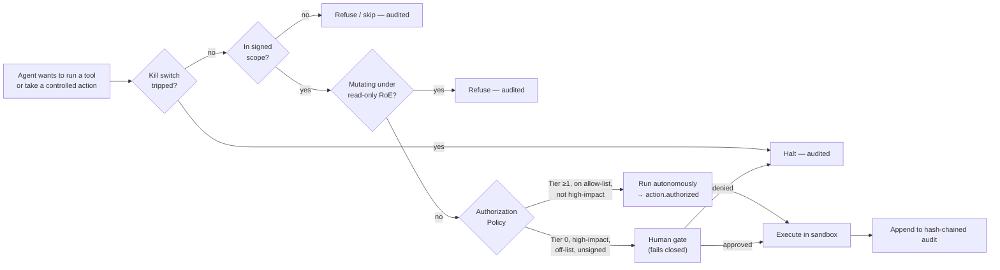
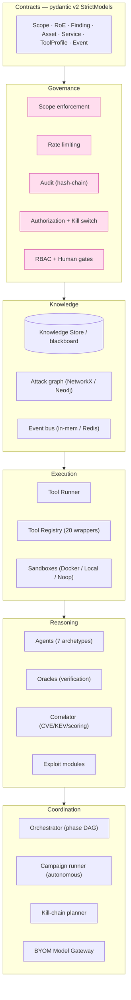
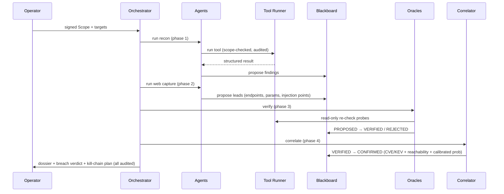

# 1 · Architecture

## The four rules (the whole design in four sentences)

Everything in the codebase traces back to four invariants. They are enforced by
the *surrounding machinery*, not by convention, so an agent — or a future
contributor — cannot violate them by accident.

| Rule | Statement | Enforced by |
|------|-----------|-------------|
| **#1 Propose vs. verify** | An agent or tool can only *propose* a finding. It becomes actionable only after a **deterministic oracle** re-checks the raw evidence and a correlator finalizes it. Models never write "confirmed". | `Finding` state machine (`PROPOSED→VERIFIED→CONFIRMED/REJECTED`) guarded in code |
| **#2 Scope-enforcing boundary** | Every packet to a target goes through the **Tool Runner**, which checks scope, rate-limits, refuses mutation under read-only RoE, and audits the call. No agent constructs a command line or reaches a target directly. | `ToolRunner.run()` + radix-trie scope + token-bucket limits |
| **#3 Roles, not tool copies** | There is **one agent class per reasoning role**. Adding "another way of attacking" is registering a *tool wrapper* and listing it in a spec — never cloning an agent. | `Archetype` registry + declarative `AgentSpec` YAML |
| **#4 Bring-your-own-model (BYOM)** | No model is hard-coded. Specs name a *task tier*; the gateway routes it to whatever provider/model is configured. | `ModelGateway` + LiteLLM provider |

## The governance envelope

The platform's identity is that **offensive capability is wrapped in a control
plane that is always in force**. A tool call cannot escape it.

Five controls, each independent:

1. **Scope** — a signed `Scope` (allow-listed CIDRs/hosts) + `RulesOfEngagement`
   (`read_only`, rate limits, `autonomy_tier`, `authorized_techniques`,
   `high_impact_actions`). Enforced at the tool boundary.
2. **Authorization policy** — decides *autonomous* vs *human-gate* per action
   from the engagement-boundary authorization (see [offensive layer](05-offensive-layer.md)).
   **Fails safe**: anything not clearly pre-authorized gates.
3. **Human gates** — for high-impact / off-list actions; **fail closed** (a gated
   action with no gate wired stops the agent).
4. **Kill switch** — thread-safe halt checked before every controlled action.
5. **Immutable audit** — every tool call, decision, and finding transition is a
   hash-chained entry (`entry_hash = H(payload ‖ prev_hash)`), so tampering is
   detectable. Backed by in-memory or SQLite/Postgres.

## The blackboard (Knowledge Store)

Agents **never call each other**. They read and write a shared
`KnowledgeStore` — the attack graph + asset inventory + every finding — and each
mutation emits an event the Orchestrator and Blue Sentry react to. This is a
classic blackboard architecture: it removes agent-to-agent coupling and gives
one auditable source of truth.

Two accuracy mechanics live here:
- **De-duplication** — union-find collapses the same finding reported by
  multiple tools, merging evidence (keyed by asset **and** injection locus
  `(path,param)` so distinct injection points never collapse).
- **Reachability** — a finding's `reachable` flag is derived from the attack
  graph, so scoring can prioritise reachable-from-entry issues.

## Layered component map

| Layer | Package(s) | Responsibility |
|-------|-----------|----------------|
| Contracts | `schemas/` | Typed, validated data shapes shared by everything (no shell strings ever reach a wrapper). |
| Governance | `governance/` | Scope, rate limits, audit, RBAC, gates, authorization, kill switch. |
| Knowledge | `knowledge/`, `eventbus/` | The blackboard, attack graph, event bus. |
| Execution | `toolrunner/` | The scope-enforcing boundary + registry + ephemeral sandboxes. |
| Reasoning | `agents/`, `verify/`, `correlate/`, `exploit/` | Role agents, deterministic oracles, CVE correlation, exploit modules. |
| Coordination | `orchestrator/`, `killchain/`, `gateway/`, `intel/`, `ad/`, `c2/`, `defense/` | The loop, campaigns, planning, model routing, dossier, identity, C2, detection testing. |

## End-to-end data flow (one engagement)

Continue to [Technologies & why →](02-technologies.md)
