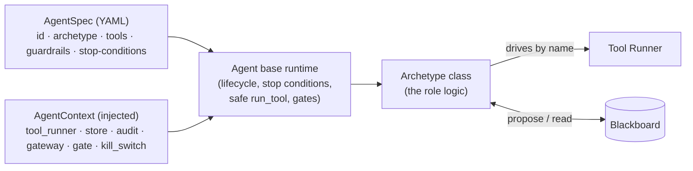

# 3 · Agents & tools

## The principle: roles, not tool copies (rule #3)

An **agent is a reasoning role**, defined by a declarative `AgentSpec` (YAML):
its archetype, the tools it may drive, its guardrails, and its stop conditions.
Agents are *executable specs* — everything they depend on (the scope-enforcing
Tool Runner, the blackboard, the model gateway, the audit log) is **injected**,
which is what makes them unit-testable and keeps the four rules enforced by the
machinery around them, not by the agent's own good behaviour.

> Adding "another way of attacking" = **write one tool wrapper + list it in a
> spec**. It is never a new agent subclass. This is why coverage grows without
> the agent count growing.

## The nine archetypes

| Archetype | Role |
|-----------|------|
| `recon_tool_driver` | Map the network attack surface (hosts, ports, services, versions). |
| `web_tool_driver` | Enumerate web surface + OWASP-class issues; screen injection points. |
| `exploit_tool_driver` | Confirm exploitability / establish footholds — gated. |
| `correlator` | Turn verified findings into prioritised, CVE/KEV-correlated leads. |
| `remediator` | Convert confirmed findings into proposed fixes/tickets. |
| `planner` | Build the goal-directed kill chain / phase plan. |
| `defensive_triage` | Blue Sentry — the detection/telemetry view. |
| `frontier` / `local` | Model task tiers (BYOM), not tool drivers. |

## The four built-in tool-driving agents

### 🛰️ Surface Mapper — `recon_tool_driver`

Maps the network. Drives a masscan-sweep → nmap-detail flow, enriches with HTTP
fingerprinting, and proposes `exposed-service:` and `web-path:` findings.

| Tool | Why it's here |
|------|---------------|
| `nmap` | Accurate service/version detection (uses `-sT` connect scan — works under `--cap-drop`). The backbone of recon. |
| `httpx` | Fast HTTP tech/version fingerprint across many ports. |
| `ffuf` | Web content/path discovery (bundled wordlist, mounted read-only). |
| `masscan` | Fast wide port sweep (bound but needs `NET_RAW`; degrades gracefully). |
| `nessus` *(licensed)* | Network vuln scan — **refused unless the RoE enables licensed tools**. |

### 🕸️ Web Inquisitor — `web_tool_driver`

The web-surface + breachability engine. Fingerprints the **edge (CDN/WAF)**
first and adapts strategy, crawls, screens injection points read-only, and
proposes leads. See [Purple-team flows](04-purple-team-flows.md).

| Tool | Why it's here |
|------|---------------|
| `nuclei` | Templated OWASP/CVE/exposure checks — breadth. Behind a CDN/WAF it runs a focused template set (full corpus is false-positive-prone against a shared edge). |
| `nikto` | Web-server misconfig / known issues (thorough; run in confirmation mode). |
| `wpscan` | WordPress enumeration when WP is present. |
| `katana` | JS-aware crawler → **parameterised endpoints** = injection leads (headless + deeper in active mode). |
| `dalfox` | Reflected-XSS discovery — **lead-gated** (skipped behind a WAF with no parameter surface; 180s cap). |
| `http_probe` | Read-only injection **screening** (status/size differentials) — the "is it breachable?" probe. Never returns body content to the model. |
| `burp_enterprise` *(licensed)* | Commercial web scanner — refused unless the RoE enables it. |

### 💥 Exploit Confirmer — `exploit_tool_driver`

Confirms exploitability behind the hard `exploit_confirm` gate. **Detection is
read-only and ungated; exploitation is gated.** See [Offensive layer](05-offensive-layer.md).

| Tool | Why it's here |
|------|---------------|
| `sqlmap_confirm` | Boolean-blind SQLi **confirmation only** — extraction flags refused. |
| `http_probe` | Scope-enforced probing the oracles/modules use. |
| `metasploit_check` | CHECK-ONLY CVE confirmation (`is_mutating` → needs non-read-only RoE + gate). |

Plus the **exploit modules** it can run (registry, 5 today): `path_traversal`,
`command_injection` (time-blind), `ssti` (math-oracle), `default_credentials`,
and `metasploit_exploit` (real initial access → live session).

### 🔧 Converter / Remediator — `remediator`

Drives **no security tool**. Turns a confirmed finding into a proposed
remediation/ticket. Actually applying a fix is gated behind `apply_fix`
(fails closed).

## Verification oracles (rule #1)

Agents propose; **oracles dispose**. Each oracle deterministically re-checks raw
evidence — no LLM in the loop — and promotes `PROPOSED → VERIFIED` or `REJECTED`:

| Oracle | Confirms |
|--------|----------|
| `version_regrab_oracle_v1` | Service/version claims (re-grab + interval match). |
| `sqli_boolean_blind_oracle_v1` | SQLi via true/false + error/quote differentials (POST-aware). |
| `reflected_xss_oracle_v1` | Marker reflects unencoded (our own marker, never target data). |
| `open_redirect_oracle_v1` | `Location` header → our marker host. |

## Agent guardrails & stop conditions

Every spec declares:
- **Guardrails** — `read_only_default`, `require_gate_before` (may *add* a gate,
  never remove one — rule #2), `active_injection_screen` (on = active, off =
  capture-only).
- **Stop conditions** — `max_findings`, `max_runtime_sec`, `max_tool_calls`,
  `on_out_of_scope` (`halt` | `skip`) — the Orchestrator enforces these so a run
  is always bounded.

Continue to [Purple-team flows →](04-purple-team-flows.md)
