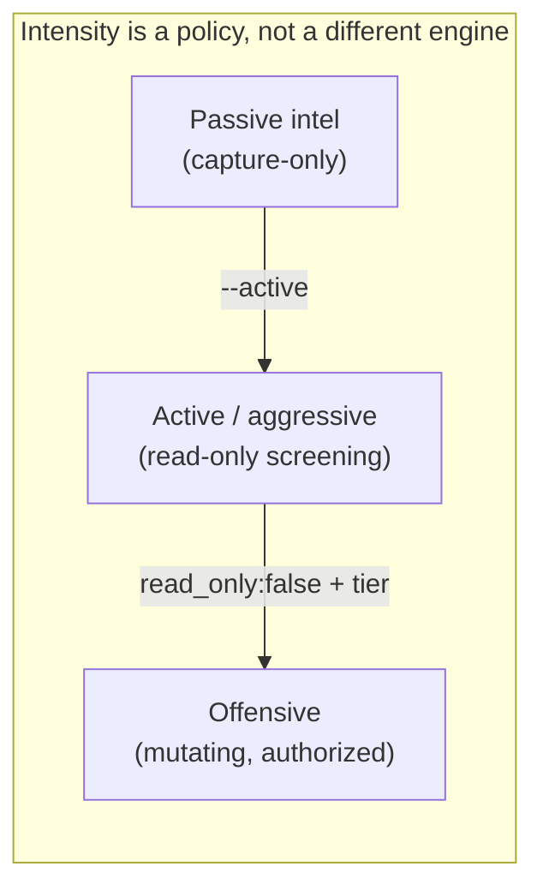
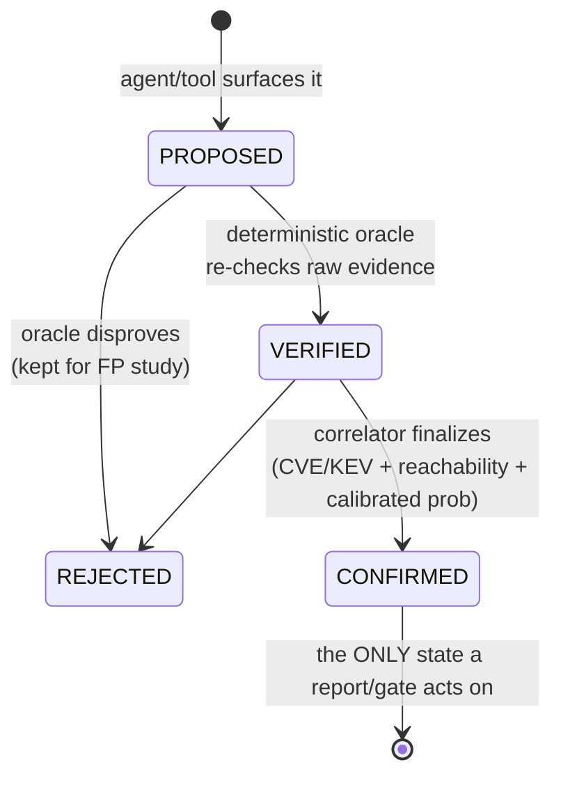
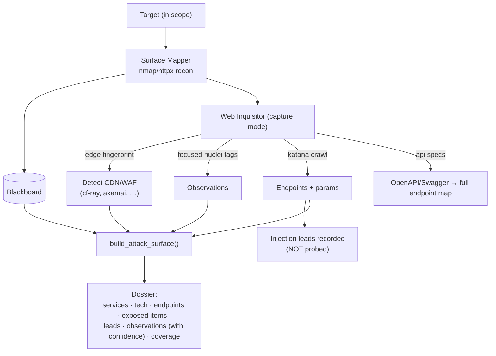
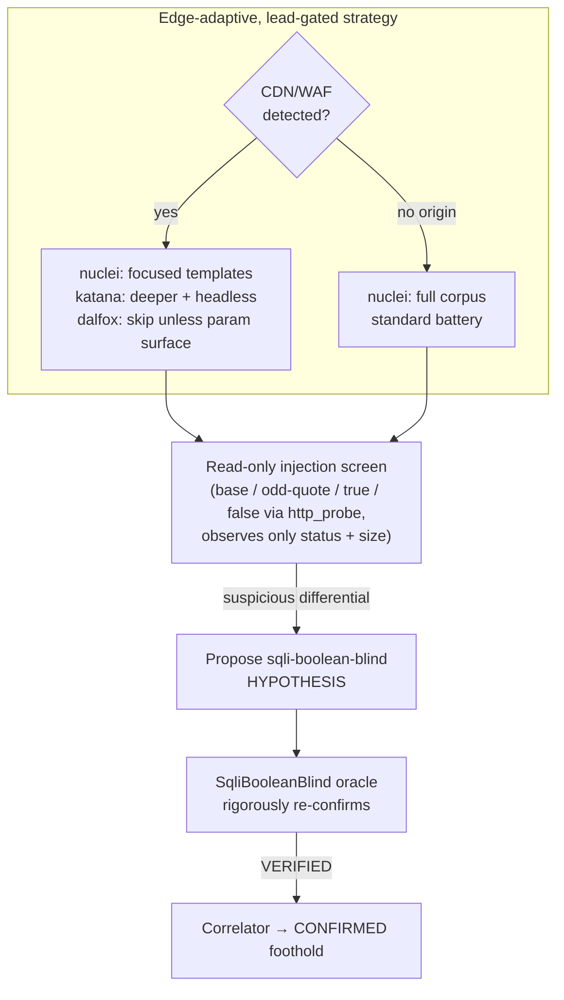
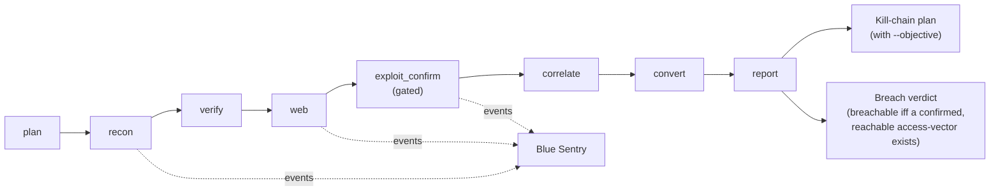

# 4 · Purple-team flows

The same engine runs at three intensities against **any authorized target** —
the *only* thing that changes what's allowed is the **signed scope**, never the
target's infrastructure type.

## The finding lifecycle (rule #1) — the spine of everything

A model can never write `state="confirmed"`; the transition is guarded in code.
This is why the dossier has **no false-positive noise** — everything shown as a
lead has survived an independent, deterministic check.

## Passive intel (capture-first)

Goal: a rich **attack-surface intelligence dossier** on any target, touching it
as little as possible. `active_injection_screen = off`.

Two quality mechanisms that make the dossier trustworthy:

- **Corroboration gate (false-positive suppression).** A high/critical scanner
  observation keeps its severity **only if the asset's own fingerprint
  corroborates it**; otherwise it is tagged `unconfirmed`. (Live example: a
  bogus `critical: VMware ESXi SLP` fired off a port mis-fingerprint on an
  nginx/Cloudflare site → correctly quarantined as unconfirmed.)
- **Coverage / tool-health.** The dossier reports which scanners ran, degraded,
  or were skipped — so a `0 leads` result is distinguishable from "0 leads
  because a scanner timed out".

## Active / aggressive scanning

Same flow, but `active_injection_screen = on`: the Web Inquisitor **actively
screens injection points read-only**, and confirmation runs the full battery.

> **Detection ≠ exploitation.** The active screen is *read-only* — it observes
> only response metadata (status/size) or our own reflected marker, never target
> data — so it is **ungated**. The gate stays for exploitation (SQLMap data
> extraction, RCE modules, MSF), which is the offensive layer.

**Aggressive without leads is waste.** The strategy is *lead-gated*: heavyweight
fuzzers only run once there's a parameter surface to justify them, and behind a
CDN/WAF the engine focuses templates and crawls deeper (to *find* leads) instead
of blasting a shared edge. This was proven live: dalfox went from burning
2 × 600 s hitting a WAF timeout to being skipped where there was nothing to fuzz.

## The full coordinated loop (Orchestrator)

`engage` runs the whole purple-team loop as a phase DAG, with **Blue Sentry**
tailing the event bus as the defensive view (it suppresses the engine's own
in-scope scans as expected noise, and raises alerts on out-of-scope / RoE
refusals).

Output: a prioritised report (risk map + hardening actions), a **breach
verdict** with the entry→asset route, and — with `--objective HOST:PRIV` — a
goal-directed [kill chain](05-offensive-layer.md).

Continue to [Offensive layer →](05-offensive-layer.md)
