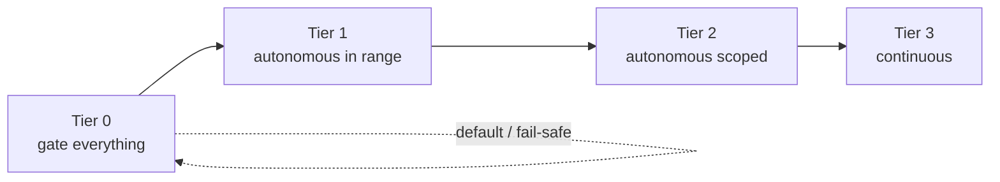
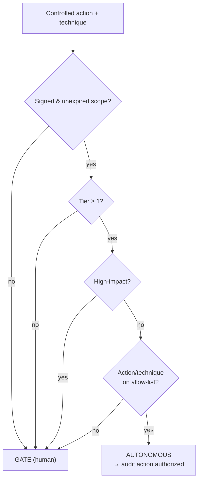
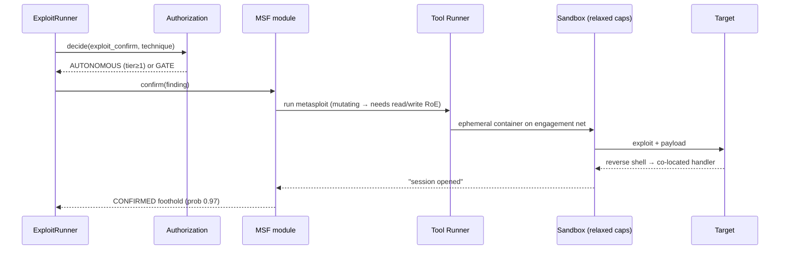
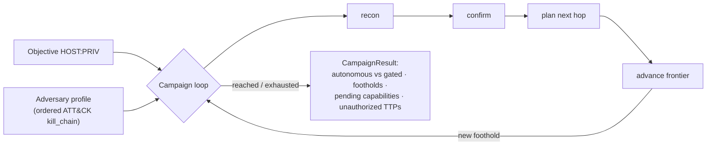
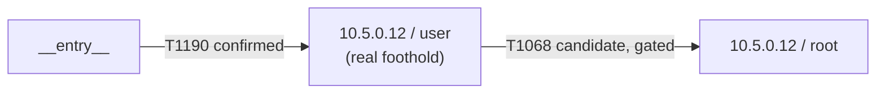
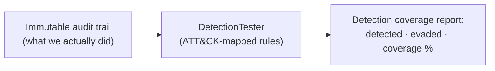

# 5 · Offensive layer

The strategy — *"From Scanner to Adversary"* — moves authorization to the
**engagement boundary**: instead of gating every action, the platform runs the
kill chain **autonomously within a signed authorization** and gates only
high-impact actions and off-list techniques. The control is *the authorization
itself*, plus a kill switch that halts everything.

## The autonomy ladder

The `RulesOfEngagement` carries:
- `autonomy_tier` (0–3),
- `authorized_techniques` — an allow-list of action names / ATT&CK IDs,
- `high_impact_actions` — always gated (`apply_fix`, `containment`,
  `data_destruction`, `dos`, `exfiltration`, `prod_data_access`).

### Authorization decision (fail-safe)

Anything ambiguous → GATE. Proven live: a Tier-2 signed engagement ran real
Metasploit exploitation **autonomously** (`action.authorized · engagement-boundary
authorization tier=2`), with **0 human gates** and the full run hash-chained.

## The layers (O0–O6)

| Layer | Capability | Status |
|-------|-----------|--------|
| **O0** | Engagement-boundary authorization, autonomy ladder, kill switch | ✅ built + enforced |
| **O1** | Autonomous, objective-directed **campaign runner** + adversary profiles | ✅ built; live (Juice Shop objective reached, 0-gated) |
| **O2** | **Real exploitation** (Metasploit) → live session foothold | ✅ built; **live-proven** (distcc → `uid=daemon`) |
| **O3** | **C2 / post-exploitation** — session manager, listeners, post-ex operator | ⚙️ built; backend is a **mock** today (see caveat) |
| **O4** | **ATT&CK technique library** + coverage matrix + capability mapping | ✅ built (~28 techniques, ~21 available / 7 planned) |
| **O5** | **Identity / AD** — BloodHound-style attack-path graph, Kerberoasting | ✅ graph + collectors built; live needs a real DC |
| **O6** | **Lateral movement**, **detection/evasion testing**, AD-forest + persistent-C2 range | ✅ planners + detection tester built; lateral execution is planning-only |

> **Honest scope line.** Initial access is *real*. Post-foothold steps (privesc,
> lateral, objective) are currently **planning labels** in the kill chain, C2 is
> a mock backend, and exploitation breadth is a small curated catalog. The
> governance, verification, and initial-access exploitation are production-grade;
> the deeper post-exploitation is proof-of-concept. This is stated plainly so the
> platform is never oversold.

## O2 — real exploitation

The `MetasploitExploitModule` maps a recon'd service to an MSF module, runs it
through the scope-enforced `metasploit` tool, and records a CONFIRMED RCE
foothold if a session opens.

Two hard-won sandbox facts (both fixed and captured in tests):
- **Reverse payloads use no explicit LHOST** — msfconsole auto-detects the
  sandbox container's own IP and the handler is co-located, so the callback
  lands without any listener coordination. (An external C2 listener is used when
  one is configured.)
- **The MSF interpreter needs Docker's default cap set** — its Alpine/musl Ruby
  cannot `execve` under `--cap-drop ALL`. Only this one tool opts out
  (`drop_all_caps=False`); read-only root, no-new-privileges, tmpfs, network
  scope, pids-limit and audit **all remain enforced**.

## O1 — autonomous campaign

Drives toward the objective **within the signed authorization**, gating only
high-impact actions. Honestly reports `pending_capabilities` (steps needing
capabilities not yet built) and `unauthorized_techniques` (profile TTPs the RoE
won't authorize).

## Kill chain (planner)

Reasons over a **privilege graph** ((host, privilege) nodes + exploit edges with
cost) to find the cheapest route from confirmed footholds to the objective.
Confirmed hops vs candidate transitions are flagged; impact phases are labelled
*gated unless authorized*. **Planning only** — it executes nothing.

## O5 — identity / Active Directory

`ADGraph` (NetworkX DiGraph) models principals (user/group/computer) and typed,
weighted edges (`MemberOf`, `AdminTo`, `HasSession`, `GenericAll`, `WriteDacl`,
…), each carrying an ATT&CK technique + cost. `attack_paths(owned)` returns the
cheapest edge-by-edge route to Domain Admin. Fed by a `from_bloodhound()`
adapter; collectors: `bloodhound` (read-only LDAP/SMB), `kerberoast` (impacket
GetUserSPNs / GetNPUsers — requests tickets, never cracks them).

## O6 — detection testing (the purple-team payoff)

`DetectionTester` runs an ATT&CK-mapped blue-team ruleset **over the audit
trail** and reports which executed techniques a SOC would have detected vs
evaded — the actual deliverable of authorized adversary emulation. It measures;
it never evades for its own sake.

---

← Back to [README](README.md)
