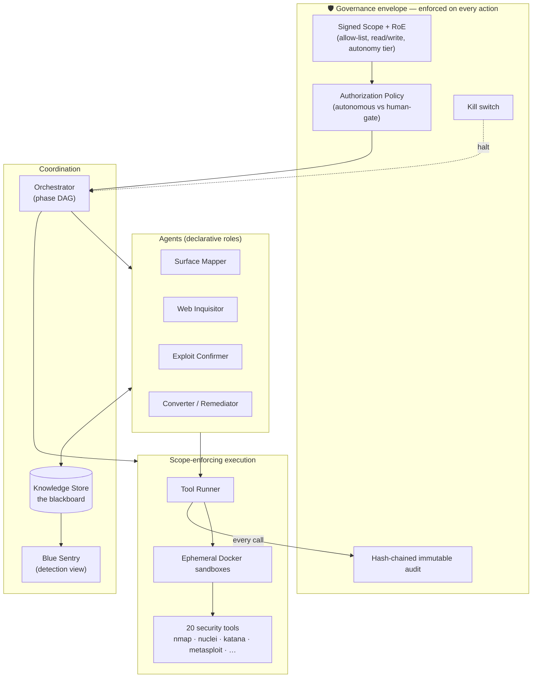

# 8π Coordinated Attack Engine — Documentation

A production-grade **purple-team → offensive security automation platform**. It
turns a signed engagement scope into an autonomous, fully-audited campaign that
maps a target's attack surface, verifies real vulnerabilities (no false-positive
noise), and — when authorized — carries out real exploitation, all inside a
governance envelope that can be halted at any time.

> **The core idea.** Anyone can point a scanner at a host. What makes this a
> *platform* is that every action is **scope-bound, authorization-gated, and
> immutably audited**, and every finding is **proven by a deterministic oracle
> before anyone acts on it**. The offensive muscle is real; the value is that
> the muzzle is controllable. *"The moat is the muzzle being controllable."*

## Read in this order

| # | Document | What it covers |
|---|----------|----------------|
| 1 | [Architecture](01-architecture.md) | The whole system: the four rules, the governance envelope, the blackboard, the layered component map, data flow. |
| 2 | [Technologies & why](02-technologies.md) | Every technology in the stack and the reason it was chosen. |
| 3 | [Agents & tools](03-agents-and-tools.md) | Each agent archetype, the tools bound to it, and *why* — plus the roles-not-tool-copies principle. |
| 4 | [Purple-team flows](04-purple-team-flows.md) | Passive intel, active/aggressive scanning, and the propose→verify→confirm lifecycle — with diagrams. |
| 5 | [Offensive layer](05-offensive-layer.md) | The autonomy ladder, authorization, real exploitation, C2/post-ex, and the goal-directed kill chain. |

## One-screen system view

## Status snapshot

- **Sprints 0–3** (foundation → verification → full purple-team loop → hardening) **complete**.
- **Offensive layers O0–O6** built and tested; **live-proven** on the local range
  (real SQLi confirmed on Juice Shop; real Metasploit RCE foothold on
  Metasploitable, `uid=daemon`).
- ~**456 tests** passing, `ruff` + `mypy --strict` clean.
- Attack-surface **intelligence dossier** with a false-positive corroboration
  gate, CDN/WAF-aware strategy, and tool-coverage reporting.

See the sprint exit-gate tests (`tests/test_sprint*_exit_gate.py`) for the
acceptance criteria each layer had to pass.
